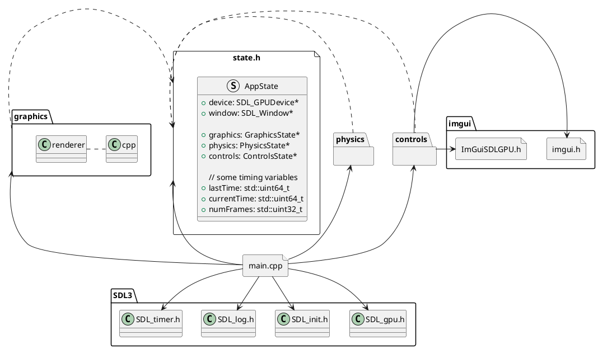
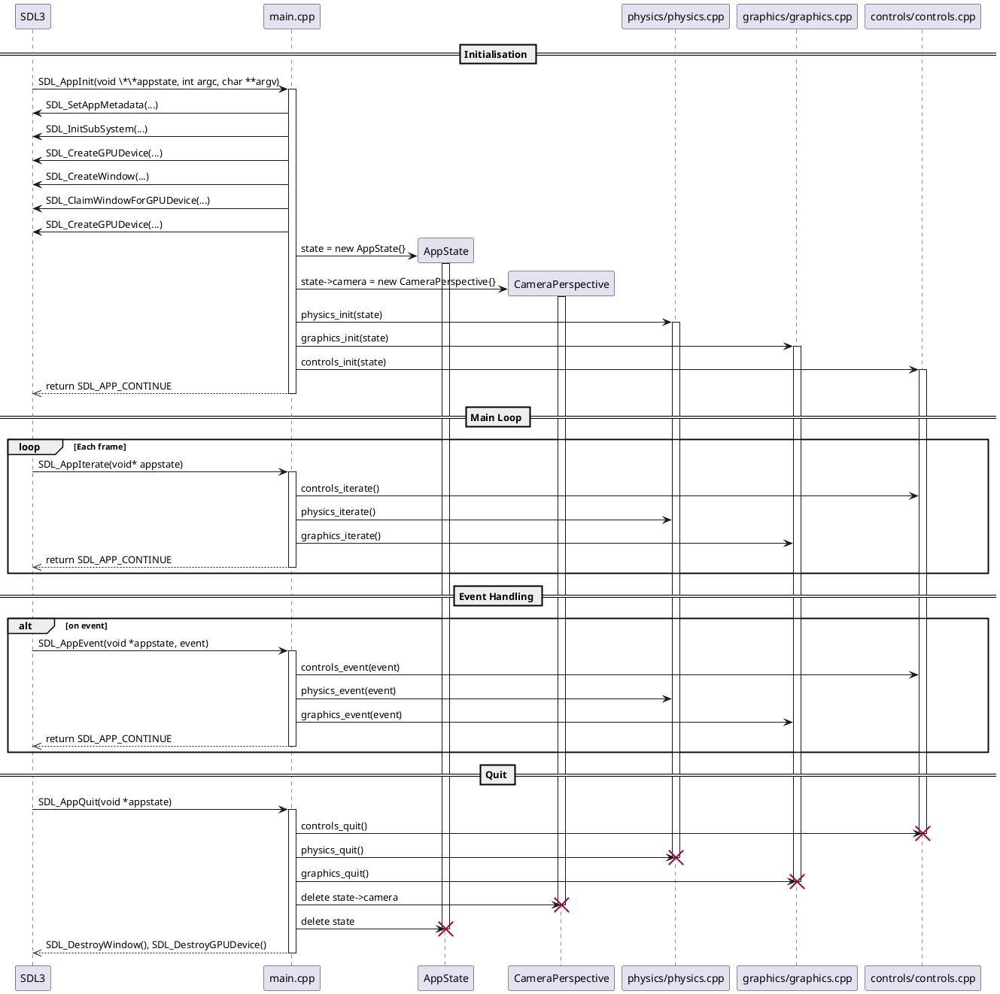

- [Pourquoi avoir choisi CMake ?](#pourquoi-avoir-choisi-cmake-)
- [Pourquoi avoir choisi une architecture procédurale ?](#pourquoi-avoir-choisi-une-architecture-procédurale-)
  - [Architecture avant](#architecture-avant)
  - [Architecture proposé](#architecture-proposé)

### Pourquoi avoir choisi CMake ?

Notre projet doit fonctionner sur plusieurs systèmes d'exploitation, ce qui nécessite une approche cross-platform. Nous voulions également un système de build unifié pour tous les membres de l'équipe, quel que soit leur environnement de développement.

Au début, le projet contenait à la fois un fichier CMakeLists.txt et un premake.lua qui construisait un workspace Visual Studio. Maintenir les deux à jour en parallèle aurait demandé des efforts constants pour s'assurer de leur conhérence l'un avec l'autre. La gestion des bibliothèques externes posait aussi problème. Le projet embarquait des biliothèques au format .lib pour ceux qui utilisait windows et findpackage pour ceux qui utilisait linux. Cette approche fait que nous n'étions pas certains de tous utiliser la même version des librairies. On avait même plusieurs librairies non utilisé dans le code.

CMake répond à ces problèms en unifiant les différences entres les platformes à travers un format unique, simple et extensible.

Ses avantages:
- Détection automatique des programmes, bibliothèques et fichiers d'en-tête nécéssaires au build, en tenant compte des variables d'environnement et du registre Windows.
- Support du build out-of-source, permettant de séparer les fichiers générés des sources. Cela facilite le nettoyage et évite tout suppression accidentelle de code source.
- Facilité à créer des étapes de build complexes, comme la compilation de shaders.
- Gestion des composants optionnels dès la phase de configuration.
- Compilation possible de plusieurs executables ou cas de test au sein d'un même projet.
- Passage simple entre build statique et dynamique, avec prise en charge transparente des drapeaux spécifiques aux plateformes.
- Support natif du build parallèle.

Tout ça nous garanti que le projet se compile de manière identique sur toutes les machine. Ça va aussi facilité la mise en place d'un pipeline CI fiable pour valider automatiquement la compilation et les convention de code.

### Pourquoi avoir choisi une architecture procédurale ?

Nous avions un problème avec l'architecture au début.

Le code était difficile à suivre malgré le peu de lignes de code. Il y avait beaucoup de dépendances et des abstractions qui n’étaient pas nécessaires. Par exemple, nous avons choisi de travailler avec SDL3 ; ajouter du code au cas où l’on changerait de librairie graphique augmentait la complexité et ajoutait du travail non productif. Les paramètres nécessaires pour faire fonctionner l'application étaient éparpillés, ce qui réduisait la cohésion du code. On se retrouvait avec une cohésion faible et un couplage fort entre les différents composants.

Au fur et à mesure que le code avancerait, il serait de plus en plus difficile de suivre et de s’adapter sans risquer de casser quelque chose. Nous avons donc décidé qu’il fallait changer l’architecture. Une rencontre d’équipe a été organisée pour discuter des différentes options, et j’ai présenté une architecture qui reprend les nouveaux concepts de SDL3 avec la [callback API](https://wiki.libsdl.org/SDL3/SDL_MAIN_USE_CALLBACKS).

La nouvelle architecture a été conçue avec les 9 principes GRASP ([General Responsibility Assignment Software Patterns](https://en.wikipedia.org/wiki/GRASP_%28object-oriented_design%29)). L’objectif principal est d’aider à concevoir un système cohérent, maintenable et extensible, en guidant la distribution des responsabilités.

Bien que ces principes soient à la base orientés objet, ils sont également applicables à une architecture procédurale. J’ai aussi mélangé les principes avec ma propre expérience en développement logiciel pour créer une architecture qui répond à nos besoins.

#### Architecture avant

```plantuml
@startuml architecture_v1

skinparam backgroundColor white

set separator ::

package "application" {
    file main.cpp {
        class Neige {
            +onInit()  override
            +onStart() override
            +onExit() override
            +onSuspend() override
            +onResume() override
            +onInput(options: Engine::Options&, deltaTime: double&, inputActions: std::vector<Engine::InputAction>&) override
            +onUpdate(options: Engine::Options&, deltaTime: double&) override
            +onDraw(options: Engine::Options&, grpahicsManager: Olaf::GraphicsManager&, deltaTime: double&) override
        }


        class main() {
            Neige engine;
        }

        Neige <-- "main()"
    }

}

Olaf::engine.h::Engine <|-- application::main.cpp::Neige

namespace Olaf {
    file engine.h {
        class Engine {
            -window: std::shared_ptr<Window>
            -isRunning: std::atomic<bool> = false
            -controlSetting: std::shared_ptr<ControlSetting>
            -graphicsManager: std::shared_ptr<GraphicsManager>
            -systemManager: std::shared_ptr<SystemManager>
            -graphicsThread: std::thread

            -targetFrameRate: double = { 60.0 }

            -options: Options

            -prevWidth: int
            -prevHeight: int

            +Engine()
            +~Engine()

            +init()
            +start()

            +virtual onInit() = 0
            +virtual onStart() = 0
            +virtual onExit() = 0
            +virtual onSuspend() = 0
            +virtual onResume() = 0
            -run();
        }
    }

    file "options.h" {

        struct RenderOptions{}
        struct WindowOptions{
            +screenWidth: int
            +screenHeight: int
        }
        struct Options{
            renderOptions: RenderOptions
            windowOptions: WindowOptions
        }

        RenderOptions --o Options
        WindowOptions --o Options

    }


    folder graphics {
        file graphic_api.h {
            enum GraphicAPI {
                None = 0
                OpenGL = 1
                Vulkan = 2
                SDL3 = 3
            }

            interface get_graphic_API()

            class Graphics {
                +Graphics() = delete;
                -static graphicAPI: GraphicAPI
                -friend get_graphicAPI(): GraphicAPI
            }
        }

        file graphic_manager.h {
            class Window{}

            class GraphicsManager {
                +init(options: Engine::Options&, window: std::shared_ptr<Window> window, onDrawCallback: std::function<void(Options&, GraphicsManager&, const double&)>)
                +update(options: Options&, dt: double)
                +close();

                -onDraw: std::function<void(Options&, GraphicsManager&, const double&)>
                -pWindow: std::shared_ptr<Window>
                -gpu: SDL_GPUDevice*
            }
        }
    }

    folder platform {
        folder system {
            file window_sdl3.h {

                class GpuDevice
                class WindowSDL3
                {
                    +WindowSDL3() = default
                    +~WindowSDL3() = default

                    +init(width: const int, height: const int, title: const char*) override
                    +setTitle(title: const char*) override
                    +setSize(width: int, height: int) override
                    +close() override
                    +isRunning() override : bool
                    +getWindow() override : WindowHandle
                    +pollEvent() override : std::vector<Event>
                    +setResizeCallback(callback: std::function<void(int,int)>) override
                    +getGpuDevice() override : GpuHandle

                    -sdlWindow: SDL_Window* = nullptr
                    -sdlGPU: SDL_GPUDevice* = nullptr
                    -resizeCallback: std::function<void int, int> = nullptr
                }
            }
        }
    }

    folder system {

        file control_setting.h{
            enum InputState {
                isPressed
                isPressedNoRepeat
                isReleased
                isDoubleClick
                JoystickAxisUp
                JoystickAxisDown
                JoystickAxisRight
                JoystickAxisLeft
            }

            enum InputAction {
                up
                down
                left
                right
                rotateLeft
                rotateRight
                start
                select
                run
                stop_run
                jump
                back
                action
                item
                shield
                aim
                stop_aim
                plant
                attack
            }

            class ControlSetting {
                +ConstrolSetting() = default
                +~ConstrolSetting() = default
                +add(key: Key, inputState: InputState, inputAction: InputAction)
                +remove(key: Key, inputState: InputState, inputAction: InputAction)
                +getInput(): std::vector<InputAction>
                -handleInput(event: Event)
                -updateInput();

                -inputMap: std::map<std::pair<Key, InputState>, std::vector<InputAction>>
                -values: std::vector<InputAction>
                -inputActive: std::map<std::pair<Key, InputState>, bool>

                -friend class SystemManager;
            }

        }
        file event.h{
            struct KeyEvent {
                +code: Key
            }

            enum EventType {
                None = 0
                KeyPressed = 1
                KeyReleased = 2
            }

            class Event {
                +union key: KeyEvent;
                +type: EventType
            }

        }
        file key_code.h{
            enum Key {
                kFirst = 3
                ...
                kLast = 271
            }
        }
        file keyboard.h{

            class Keyboard {
                +static init()
                +static update()
                +static key(keyVal: Key): bool
                +static keyDown(keyVal: key): bool
                +static keyUp(keyVal: Key): bool

                -constexpr static keyCount: const int = 291; // SDL support up to index 290

                -static keys: std::array<bool, keyCount>
                -static keysDown: std::array<bool, keyCount>
                -static keysUp: std::array<bool, keyCount>
            }

            class _{
                +is_key_pressed(keyVal: Key): bool
                +is_key_pressed_no_repeat(keyVal: Key): bool
                +is_key_released(keyVal: Key): bool
            }

        }
        file log_manager.h{
            class LogManager {
                +static init(logFileName: const std::string& = "app_logs.txt")
                +static shutdown()

                -static isInitialized: bool
                -static logger_: std::shared_ptr<spdlog::logger>
            }
        }
        file log.h{
            annotation notes {
                bunch of stuff
            }
        }
        file system_manager.h{

            class Window;
            class ControlSetting;

            class SystemManager {
                +init(options: WindowOptions&, controlSetting: std::shared_ptr<ControlSetting>, onInputCallback: std::function<void(Options&, const double&, const std::vector<InputAction>&)>)
                +update(option: Options&, dt: double)
                +close()
                +getWindow(): std::shared_ptr<Window>

                -onInput: std::function<void(Options&, const double&, const std::vector<InputAction>&)>
                -pWindow: std::shared_ptr<Window>
                -pControlSetting: std::shared_ptr<ControlSetting>
            }
        }
        file window.h{
            class Event

            struct GpuHandle {
                +ptr: void* = nullptr
                +as(): T* { return static_cast<T*>(ptr)}
                +valid(): bool {return ptr != nullptr;}
            }

            enum WindowAPI {
                None
                SDL3
            }

            class Window {
                +virtual init(width: const int, height: const int, title: const char* ): bool = 0;
                +virtual setTitle(title: const char*) = 0;
                +virtual setSize(width: const int, height: const int) = 0;
                +virtual close() = 0;
                +virtual isRunning() = 0;
                +virtual getWindow(): WindowHandle = 0
                +virtual enableEventForHUD() { isEventEnableForHUD = true; }
                +virtual disableEventForHUD() { isEventEnableForHUD = false; }
                +virtual pollEvent(): std::vector<Event> = 0
                +virtual setResizeCallback(callback: std::function<void(int, int)>) = 0
                +virtual getGpuDevice(): GpuHandle = 0

                +static create(windowAPI: WindowAPI): std::shared_ptr<Window>
                #width: int = 0
                #height: int = 0
                #running: bool = true;
                #isEventEnableForHUD: bool = false
                #title: const char* = nullptr
                #graphicAPI: GraphicAPI = GraphicAPI::None
                #windowAPI: WindowAPI = WindowAPI::None
            }

        }

    }
}

Olaf::engine.h --> Olaf::graphics::graphic_api.h
Olaf::engine.h --> Olaf::graphics::graphic_manager.h
Olaf::engine.h --> Olaf::options.h
Olaf::engine.h --> Olaf::system::system_manager.h
Olaf::engine.h --> Olaf::system::window.h
Olaf::engine.h --> std::memory
Olaf::engine.h --> std::thread
Olaf::engine.cpp ..|> Olaf::engine.h
Olaf::engine.cpp --> Olaf::system::control_setting.h
Olaf::engine.cpp --> Olaf::system::log_manager.h

Olaf::graphics::graphic_api.cpp ..|> Olaf::graphics::graphic_api.h

Olaf::graphics::graphic_manager.h ..> Olaf::options.h
Olaf::graphics::graphic_manager.h --> std::functional
Olaf::graphics::graphic_manager.h --> std::memory
Olaf::graphics::graphic_manager.cpp ..|> Olaf::graphics::graphic_manager.h
Olaf::graphics::graphic_manager.cpp ..> Olaf::system::log.h
Olaf::graphics::graphic_manager.cpp --> Olaf::system::window.h
Olaf::graphics::graphic_manager.cpp --> libs::SDL3::SDL_gpu.h

Olaf::platform::system::window_sdl3.h --> Olaf::system::event.h
Olaf::platform::system::window_sdl3.h --> Olaf::system::window.h
Olaf::platform::system::window_sdl3.h --> std::functional
Olaf::platform::system::window_sdl3.h::WindowSDL3 --|> Olaf::system::window.h::Window
Olaf::platform::system::window_sdl3.cpp ..|> Olaf::platform::system::window_sdl3.h
Olaf::platform::system::window_sdl3.cpp ..> Olaf::graphics::graphic_api.h
Olaf::platform::system::window_sdl3.cpp ..> Olaf::system::log.h
Olaf::platform::system::window_sdl3.cpp --> libs::SDL3::SDL_gpu.h
Olaf::platform::system::window_sdl3.cpp --> libs::SDL3::SDL_init.h
Olaf::platform::system::window_sdl3.cpp --> libs::SDL3::SDL_render.h

Olaf::system::control_setting.h .. Olaf::system::event.h
Olaf::system::control_setting.h ..> Olaf::system::keyboard.h
Olaf::system::control_setting.h --> std::map
Olaf::system::control_setting.h --> std::vector
Olaf::system::control_setting.cpp ..|> Olaf::system::control_setting.h
Olaf::system::control_setting.cpp ..> std::algorithm

Olaf::system::event.h --> Olaf::system::key_code.h

Olaf::system::keyboard.h --> Olaf::system::key_code.h
Olaf::system::keyboard.h --> std::array
Olaf::system::keyboard.cpp ..|> Olaf::system::keyboard.h
Olaf::system::keyboard.cpp --> Olaf::system::log.h
Olaf::system::keyboard.cpp --> libs::SDL3::SDL_keyboard.h

Olaf::system::log_manager.h --> libs::spdlog::spdlog.h
Olaf::system::log_manager.h --> std::memory
Olaf::system::log_manager.h --> std::string
Olaf::system::log_manager.cpp ..|> Olaf::system::log_manager.h
Olaf::system::log_manager.cpp ..> Olaf::system::log.h
Olaf::system::log_manager.cpp --> libs::spdlog::sinks::basic_file_sink.h
Olaf::system::log_manager.cpp --> libs::spdlog::sinks::stdout_color_sinks.h
Olaf::system::log_manager.cpp --> libs::spdlog::spdlog.h

Olaf::system::log.h ..> libs::spdlog::sinks::basic_file_sink.h
Olaf::system::log.h ..> libs::spdlog::sinks::stdout_color_sinks.h
Olaf::system::log.h ..> libs::spdlog::spdlog.h

Olaf::system::system_manager.h ..> Olaf::options.h
Olaf::system::system_manager.h --> Olaf::system::control_setting.h
Olaf::system::system_manager.h --> std::functional
Olaf::system::system_manager.h --> std::memory
Olaf::system::system_manager.cpp ..|> Olaf::system::system_manager.h
Olaf::system::system_manager.cpp ..> Olaf::system::event.h
Olaf::system::system_manager.cpp ..> Olaf::system::log_manager.h
Olaf::system::system_manager.cpp --> Olaf::system::window.h

Olaf::system::window.h ..> Olaf::graphics::graphic_api.h
Olaf::system::window.h ..> std::functional
Olaf::system::window.h ..> std::memory
Olaf::system::window.h ..> std::vector
Olaf::system::window.cpp ..|> Olaf::system::window.h
Olaf::system::window.cpp ..> Olaf::platform::system::window_sdl3.h
Olaf::system::window.cpp ..> Olaf::system::log.h


@enduml
```

#### Architecture proposé

Apres avoir retravailler un peu les concept, voici comment la vie de l'application va se dérouler:

Chaque sous modules sont maintenant responsable de leur propre état tout en gardant tout disponnible pour chaque module. ça permet de faire des snapshot de l'état de l'application à tout moment et de reproduire des images pour effectuer des tests.
